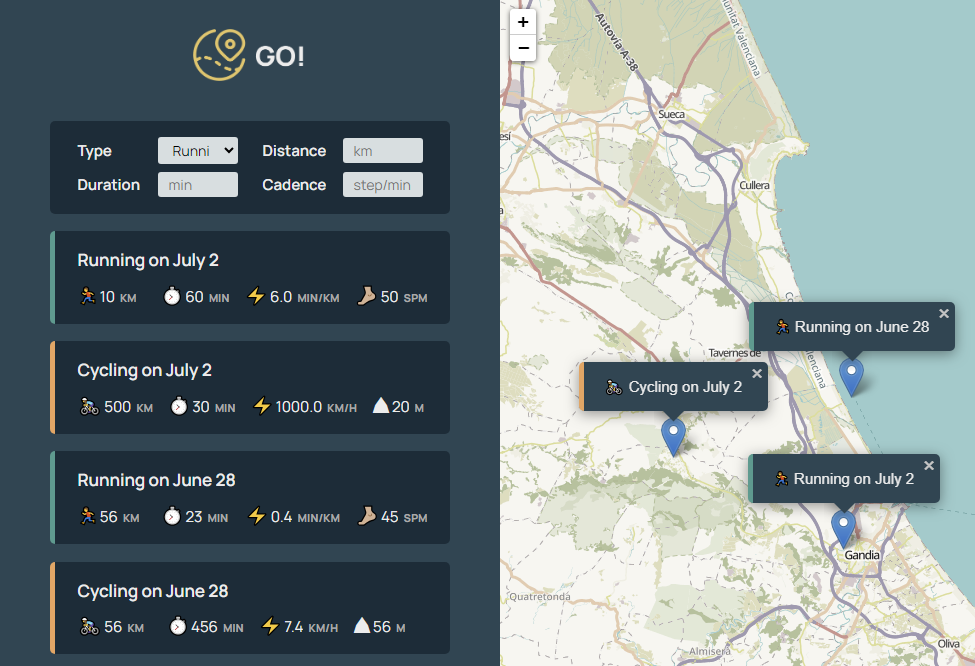

# GO! App to organize your workouts

App built with JavaScript and OOP. Map all your workouts: you can see displayed on the map all your workouts which are logged in with location, distance, time.
It uses [Leafletjs](https://leafletjs.com/) for mobile-friendly interactive maps.

## Features

- OOP
- Leaflet: setView() method to get you to the coordinates
- API: Localstorage
- Class, Inheritance, Encapsulation

